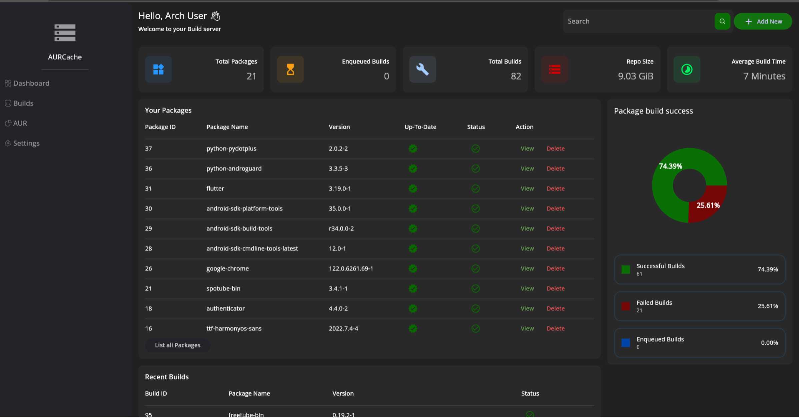
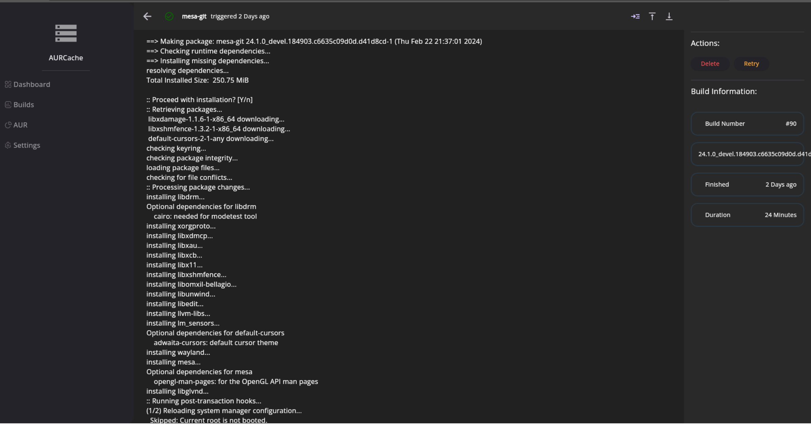
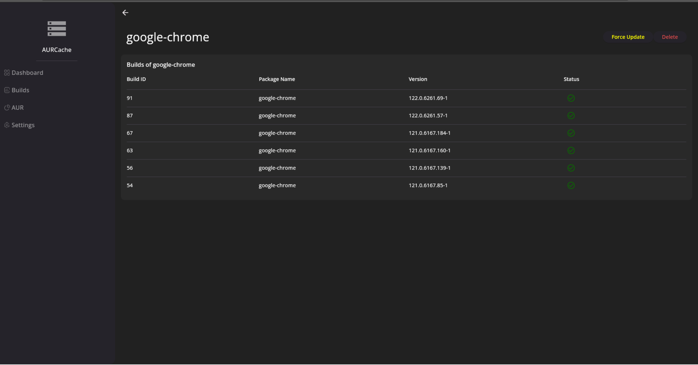

# AURCache

AURCache is a build server and repository for Archlinux packages sourced from the AUR (Arch User Repository). It features a Flutter frontend and Rust backend, enabling users to add packages for building and subsequently serves them as a pacman repository. Notably, AURCache automatically detects when a package is out of date and displays it within the frontend.

<p> 

<details>
<summary>More Images:</summary>
<br>
 
</p>
</details>

## Deployment with Docker and Docker-compose

To deploy AURCache using Docker and Docker-compose, you can use the following example docker-compose.yml file:

```yaml
version: '3'
services:
    aurcache:
        image: ghcr.io/lukas-heiligenbrunner/aurcache:latest
        ports:
        - "8080:8080"
        - "8081:8081"
        volumes:
          - ./aurcache/db:/app/db
          - ./aurcache/repo:/app/repo
        privileged: true 
```

Make sure to define the db path and repo path as volumes.

The default Port 8081 serves the Frontend and Port 8080 serves the Repository.
It needs to be a priviledged container to be able to use dind for spawining build containers.

If you are uncomfortable with the priviledged container you can pass through the docker socket and create a volume mounted to
`/app/builds` on aurcache container and set the `BUILD_ARTIFACT_DIR` environment variable to the volume.

For example:
```yaml
version: '3'
services:
    aurcache:
        image: ghcr.io/lukas-heiligenbrunner/aurcache:latest
        ports:
        - "8080:8080"
        - "8081:8081"
        volumes:
          - ./aurcache/db:/app/db
          - ./aurcache/repo:/app/repo
          - /var/run/docker.sock:/var/run/docker.sock
          - artifact_cache:/app/builds
        environment:
          - BUILD_ARTIFACT_DIR=artifact_cache # also absolute path is possible
volumes:
  artifact_cache:
        name: artifact_cache # this name should match env name above
        driver: local
```

But keep in mind with this method containers are spawned on the host system and not in the aurcache container.
(And destroyed afterwards)

To start AURCache with Docker-compose, run:

```bash
docker-compose up -d
```

Access AURCache through your web browser at http://localhost:8081.

You can now start adding packages for building and utilizing the AURCache repository.

Add the following to your `pacman.conf` on your target machine to use the repo:

```bash
# nano /etc/pacman.conf
[repo]
SigLevel = Optional TrustAll
Server = http://localhost:8080/
```

### Docker Tags
`:git` - current master branch build

`:latest` - latest version 

`:<version>` - <version> git tag (latest version = latest tag)
## Configuration
Environment Variables

| Variable               | Type                  | Description                                                         | Default                   |
|------------------------|-----------------------|---------------------------------------------------------------------|---------------------------|
| DB_TYPE                | (POSTGRESQL\| SQLITE) | Type of Database (SQLite, PostgreSQL)                               | SQLITE                    |
| DB_USER                | String                | POSTGRES Username  (ignored if sqlite)                              | null                      |
| DB_PWD                 | String                | POSTGRES Password  (ignored if sqlite)                              | null                      |
| DB_HOST                | String                | POSTGRES Host   (ignored if sqlite)                                 | null                      |
| DB_NAME                | String                | Database name                                                       | 'db.sqlite' or 'postgres' |
| VERSION_CHECK_INTERVAL | Integer               | Interval in seconds for checking package versions                   | 3600                      |
| BUILD_ARTIFACT_DIR     | String                | pkg share directory between aurcache container and build containers | null                      |
| LOG_LEVEL              | String                | Log level                                                           | INFO                      |
| MAX_CONCURRENT_BUILDS  | Integer               | Max concurrent builds                                               | 1                         |
| CPU_LIMIT              | Integer               | CPU limit of build container in milli CPUs                          | 0                         |
| MEMORY_LIMIT           | Integer               | Memory limit of build container in MB                               | -1                        |
| JOB_TIMEOUT            | Integer               | Job timeout for build in Seconds                                    | 3600                      |
| OAUTH_AUTH_URI         | String                | Oauth authorize endpoint                                            | null                      |
| OAUTH_TOKEN_URI        | String                | Oauth token endpoint                                                | null                      |
| OAUTH_REDIRECT_URI     | String                | Oauth redirect uri back to AURCache                                 | null                      |
| OAUTH_CLIENT_ID        | String                | Oauth client ID                                                     | null                      |
| OAUTH_CLIENT_SECRET    | String                | Oauth client Secret                                                 | null                      |
| SECRET_KEY             | String                | \>32Byte Random String for singing cookies                          | Random                    |

To disable Oauth support (default) leave all OAUTH_* variables undefined.
## Build Info

The AURCache project comprises two main components: a Flutter frontend and a Rust backend.
### Frontend (Flutter)

To build the Flutter frontend, ensure you have Flutter SDK installed. Then, execute the following commands:

```bash
cd frontend
flutter pub get
flutter build web
```

### Backend (Rust)

To build the Rust backend, make sure you have Rust installed. Then, navigate to the backend directory and run:

```bash
cd backend
cargo build --release
```

## Things still missing

* proper error return from api
* proper logging
* auto update packages
* implement repo-add in rust
* keep older pkg versions in repo (repo-add limitation)


## Contributors

    Lukas-Heiligenbrunner

## License

This project is licensed under the MIT License. Feel free to contribute and modify as per the guidelines outlined in the license agreement.
