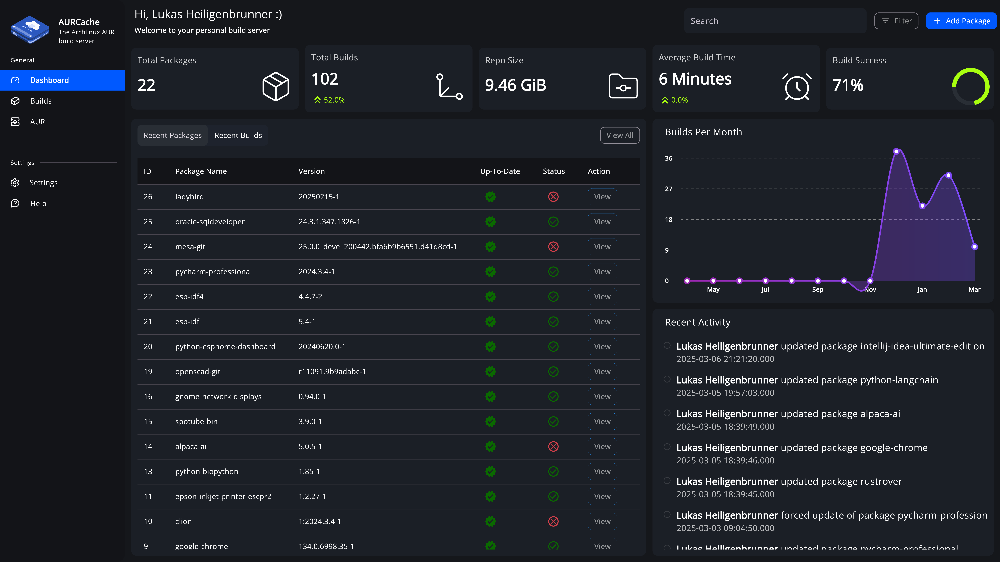
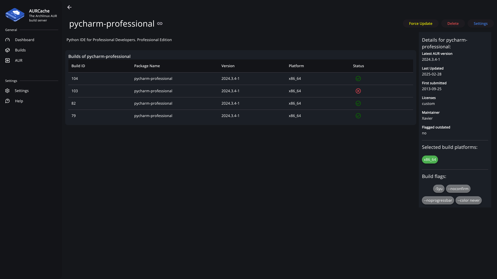
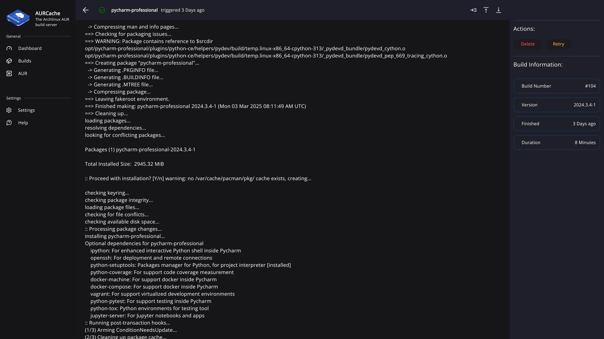

    <!-- </a> being on the same line as the  tag is intentional! -->
     
     
    
    
    
     

<h4 align="center">
  <a href="https://lukas-heiligenbrunner.github.io/AURCache/docs/overview/introduction">Documentation</a> |
  <a href="https://lukas-heiligenbrunner.github.io/AURCache/">Website</a>
</h4>

# AURCache

AURCache is a build server and repository for Archlinux packages sourced from the AUR (Arch User Repository). It features a Flutter frontend and Rust backend, enabling users to add packages for building and subsequently serves them as a pacman repository. Notably, AURCache automatically detects when a package is out of date and displays it within the frontend.

 

More Images:

 
 

## License

This project is licensed under the MIT License. Feel free to contribute and modify as per the guidelines outlined in the license agreement.
